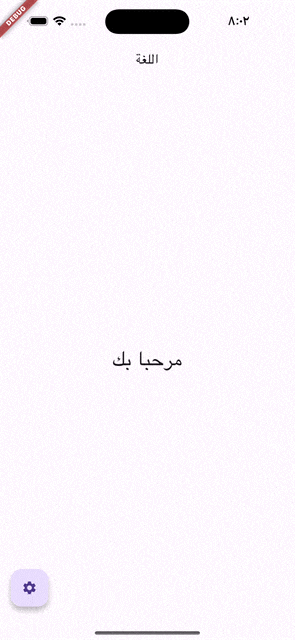
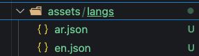

# app_local

**A lightweight, powerful Flutter package that enables instant app localization with dynamic language switching, persistent settings, and native device language support - all with minimal setup required.**

## Features
- 🚀 Easy app localization
- 🔄 Dynamic locale switching
- 💾 Automatic locale persistence
- 📱 Phone default language support
- 🔌 Simple integration with `LocaleText` widget
- ⚡ Minimal setup required

## Example


## Getting Started

### 1. Setup Assets
1. Create an `assets/lang` folder in your project root
2. Add your locale JSON files (e.g., `en.json`, `ar.json`)



Example locale files:

```json
// en.json
{
  "welcome": "Welcome to the App",
  "change_lang": "Change the language"
}

// ar.json
{
  "welcome": "مرحبا بك في التطبيق",
  "change_lang": "تغيير لغة التطبيق"
}
```

### 2. Add Dependencies

```yaml
dependencies:
  flutter:
    sdk: flutter
  app_local: ^latest_version

# Add assets path
flutter:
  uses-material-design: true
  assets:
    - assets/lang/
```

### 3. Initialize

Add this to your `main.dart`:

```dart
void main() async {
  WidgetsFlutterBinding.ensureInitialized();
  
  await Locales.init(
    localeNames: ['en', 'ar'],  // Your supported locales
    localPath: "assets/lang/",   // Path to your locale files
    phoneLocale: true,          // Use phone's default locale
  );
  
  runApp(MyApp());
}
```

Wrap your `MaterialApp` with `LocaleBuilder`:

```dart
class MyApp extends StatelessWidget {
  @override
  Widget build(BuildContext context) {
    return LocaleBuilder(
      builder: (locale) => MaterialApp(
        title: 'App Local',
        localizationsDelegates: Locales.delegates,
        supportedLocales: Locales.supportedLocales,
        locale: locale,
        home: HomeScreen(),
      ),
    );
  }
}
```

## Usage

### Display Translated Text

Using widget:
```dart
LocaleText('welcome');
```

Using string:
```dart
// Using static method
Locales.string(context, 'welcome');

// Using extension
context.localeString('welcome');
```

### Change Locale

```dart
// Using static method
Locales.change(context, 'ar');

// Using extension
context.changeLocale('ar');

// Switch to device locale
Locales.change(context, 'auto');
```

### Get Current Locale

```dart
// Using static method
Locales.currentLocale(context);

// Using extension
context.currentLocale;
```

### iOS

Add the following to your `Info.plist` file if you want to support device default language:

```xml
<key>CFBundleLocalizations</key>
<array>
  // Add your supported locales here
  <string>en</string>
  <string>ar</string>
</array>
```